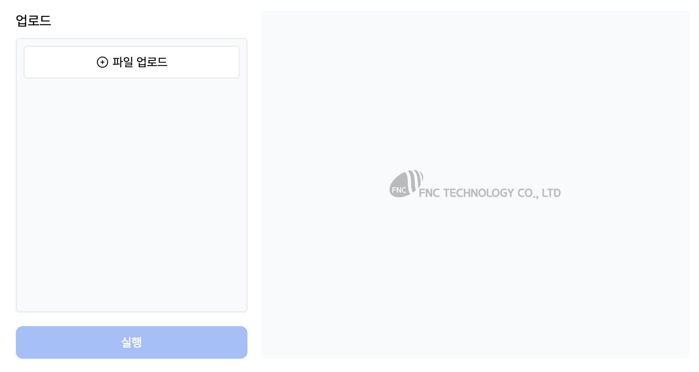
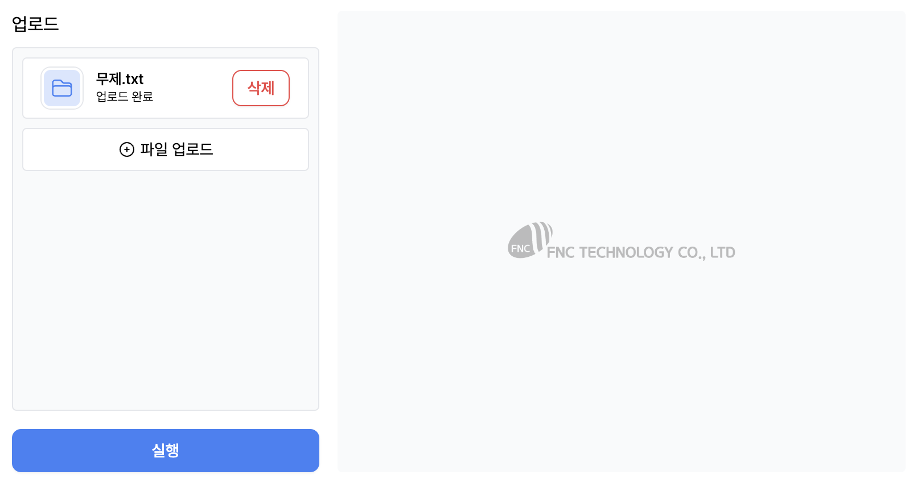
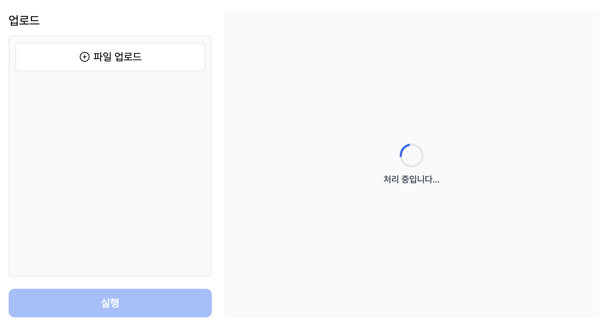
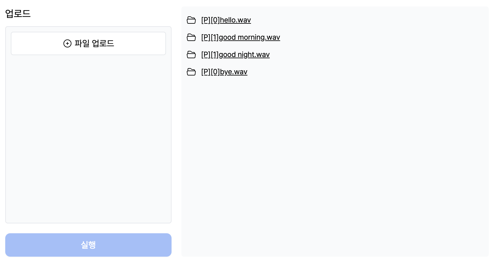

# LightSpeech WebUI (local version)

[LightSpeech: Lightweight and Fast Text to Speech with Neural Architecture Search, ICASSP 2021](https://arxiv.org/abs/2102.04040), by Renqian Luo, Xu Tan, Rui Wang, Tao Qin, Jinzhu Li, Sheng Zhao, Enhong Chen and Tie-Yan Liu  
[Original Github](https://github.com/microsoft/NeuralSpeech/blob/master/LightSpeech)

## Dependencies

- Python=3.8

```bash
cd LightSpeech/backend
pip install -r requirements.txt
```

## How to Start

### 1. Install nvm and nodejs and run

```bash
cd LightSpeech/frontend
curl -o- https://raw.githubusercontent.com/nvm-sh/nvm/v0.39.1/install.sh | bash
source ~/.bashrc
nvm install 18.17.0
npm install
npm run build
npm run dev
```

### 2. Install python packages and run

```bash
cd ../backend
mkdir data
```
download ljspeech data from [here](https://drive.google.com/drive/folders/17UkcWbZ7hIIrfSCG_MjaiAw82NCL0LJN) and move to LightSpeech/backend/data

```bash
pip install -r requirements.txt
python main.py
```

Now you can access to localhost:3000

### 3. UI screenshot





